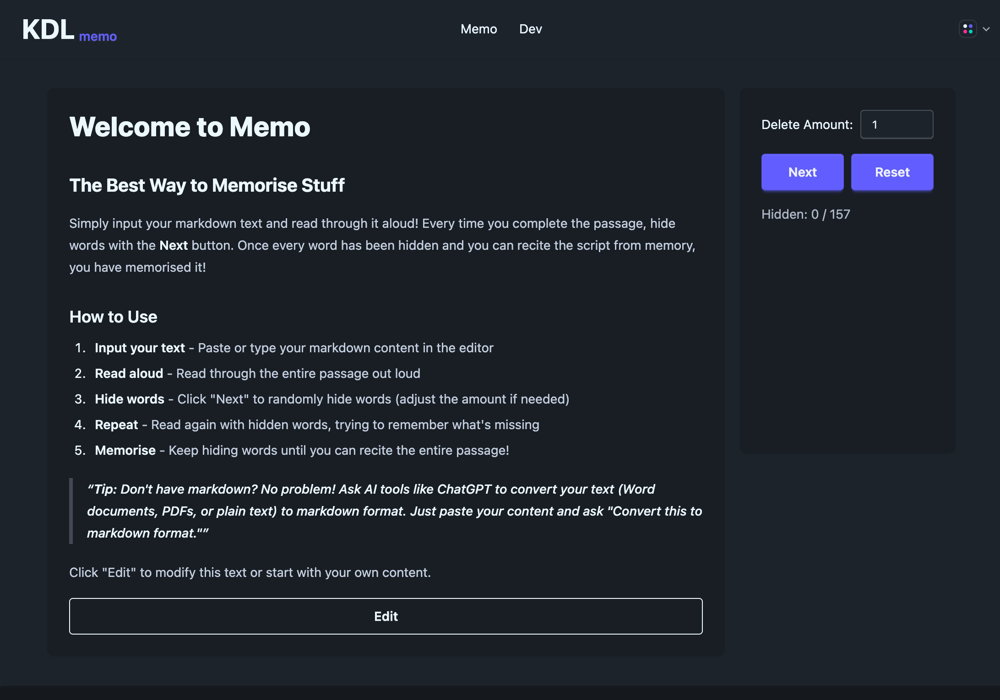

# [memo](https://memo.kyledlong.com)

A text memorisation tool built with React. Progressively hide words to encourage active recall and memorisation.



## Features

- **Markdown Support** - Input and render markdown formatted text
- **Progressive Word Hiding** - Randomly hide words as you practice
- **Active Recall** - Read through passages with hidden words to strengthen memory
- **Simple Interface** - Clean, intuitive UI built with Tailwind CSS and DaisyUI

## Getting Started

### Installation

```bash
npm install
```

### Development

```bash
npm run dev
```

### Build

```bash
npm run build
```

## How to Use

1. **Input your text** - Paste or type markdown content in the editor
2. **Save & Preview** - Click to see your markdown rendered
3. **Practice** - Read through the passage aloud
4. **Hide words** - Click "Next" to randomly hide words (adjust amount if needed)
5. **Repeat** - Keep hiding words until you can recite from memory!

## Tech Stack

- React 19
- Vite
- Tailwind CSS v4
- DaisyUI
- react-markdown
- remark (AST manipulation)

## Documentation

For detailed architecture and implementation details, see the [Dev page](./src/components/Dev.jsx) in the application.

## License

MIT
